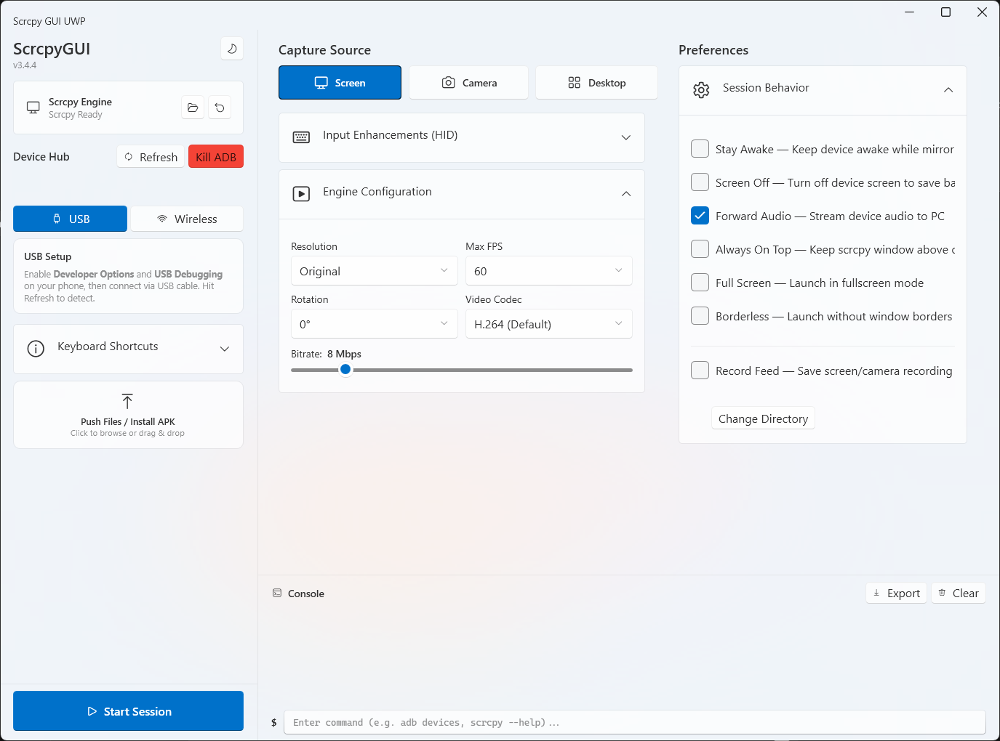

# Scrcpy GUI UWP



A Windows desktop GUI for [scrcpy](https://github.com/Genymobile/scrcpy), built for quick Android screen mirroring, wireless ADB setup, camera mode, virtual display sessions, file transfer, and common scrcpy launch options.

This project is a .NET/WPF-UI reimplementation inspired by [kil0bit-kb/scrcpy-gui](https://github.com/kil0bit-kb/scrcpy-gui). It keeps the same spirit of a polished scrcpy control surface while rebuilding the app for a native Windows desktop workflow.

## Status

Work in progress. The app can launch and manage scrcpy sessions, but some features may still change while the UI and packaging are being refined.

## Features

- Clean Windows desktop interface with light/dark theme support.
- Scrcpy engine status with custom path selection and reset.
- USB device discovery through ADB.
- Wireless ADB connect, Android 11+ pairing, recent device history, and ADB reset.
- Screen mirroring, camera source, and virtual desktop display modes.
- Resolution, FPS, rotation, codec, and bitrate controls.
- HID keyboard/mouse and OTG-oriented options.
- Session options for stay awake, screen off, audio forwarding, always on top, fullscreen, borderless, and recording.
- Drag-and-drop file push and APK install.
- Built-in command console for `adb` and `scrcpy` commands.
- Diagnostic log export.

## Download

Download the latest installer from the [GitHub Releases page](https://github.com/alfarisauliarahman/scrcpy-gui-uwp/releases).

The release installer is intended for normal users. Building from source is only needed if you want to modify the app.

## Requirements

- Windows 10 or newer.
- Android device with Developer Options enabled.
- USB Debugging for USB connections.
- Wireless Debugging for wireless pairing/connect mode.
- `scrcpy` and `adb`, either bundled/downloaded by the app or selected manually from a custom scrcpy folder.

## Quick Start

1. Install Scrcpy GUI UWP from the latest release.
2. Open the app.
3. Make sure the Scrcpy Engine panel shows that scrcpy is ready.
4. Connect your Android device by USB, or use the Wireless tab to connect/pair over Wi-Fi.
5. Choose a capture source: Screen, Camera, or Desktop.
6. Adjust session settings if needed.
7. Click Start Session.

## Wireless Pairing

For Android 11 and newer:

1. Enable Developer Options on your Android device.
2. Open Wireless Debugging.
3. Choose Pair device with pairing code.
4. Enter the shown `IP:Port` and pairing code in the app.
5. After pairing, connect to the device IP, usually on port `5555`.

Both the PC and Android device must be on the same network.

## Build From Source

Install the .NET SDK that supports `net10.0-windows`, then run:

```powershell
git clone https://github.com/alfarisauliarahman/scrcpy-gui-uwp.git
cd scrcpy-gui-uwp
dotnet restore ScrcpyGui.csproj
dotnet build ScrcpyGui.csproj -c Release
dotnet run --project ScrcpyGui.csproj
```

To create a publish folder:

```powershell
dotnet publish ScrcpyGui.csproj -c Release -r win-x64 --self-contained true
```

The current source targets Windows desktop with WPF and WPF-UI Fluent controls.

## Credits

- [kil0bit-kb/scrcpy-gui](https://github.com/kil0bit-kb/scrcpy-gui) - original ScrcpyGUI project and inspiration, licensed under MIT.
- [Genymobile/scrcpy](https://github.com/Genymobile/scrcpy) - the core Android mirroring engine, licensed under Apache License 2.0.
- [WPF-UI](https://github.com/lepoco/wpfui) - Fluent Windows UI controls for WPF.
- [CommunityToolkit.Mvvm](https://github.com/CommunityToolkit/dotnet) - MVVM helpers.

Some README wording and feature framing is adapted from the original ScrcpyGUI README under the MIT License.

## License

This project is licensed under the MIT License. See [LICENSE](LICENSE) for details.

This project is independent and is not affiliated with Genymobile, the scrcpy authors, or kil0bit-kb.
